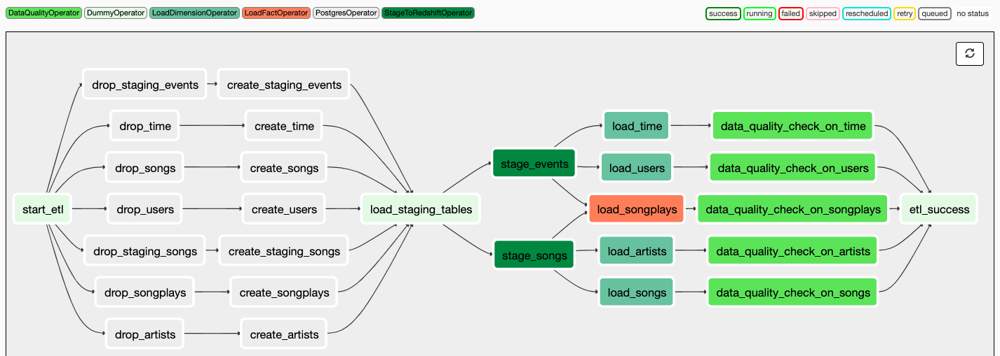
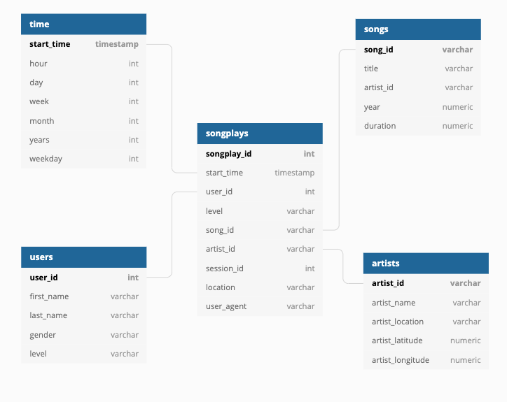

# Project 5: Data Pipelines with Airflow

<p align="center"></p>

## Introduction
As a data engineer, I was responsible for automating and monitoring the data warehouse ETL pipelines at Sparkify. Specifically, I delivered a dynamic and high grade data pipeline, which not only allowed for scheduled backfilling but also monitoring to ensure data quality. Data quality plays a big part in the analytics team at Sparkify, thus after the automated ETL processes, analyses were executed on top of the data warehouse with tests run to catch any discrepancies in the datasets.

The source data resides in S3 and needed to be processed in Sparkify's data warehouse in Amazon Redshift. The source datasets consist of CSV logs that tell about user activity in the application and JSON metadata about the songs the users listen to.

### Achievements
As their data engineer, I was responsible for automating the ETL pipelines through Airflow, extracting data from S3, loading data into staging tables and transforming the data into a star schema stored in Amazon Redshift. The data warehouse (automatically generated by the Airflow tasks) were then validated using custom analyses to detect any discrepancies in the databases.
Skills include:
* Using Airflow to automate ETL pipelines using Airflow, Python, Amazon Redshift.
* Transforming data from various sources into a star schema optimized for the analytics team's use cases.
* Writing custom operators to perform tasks such as staging data, filling the data warehouse, and validation through data quality checks.
* Setting up IAM Roles, Redshift Clusters, Airflow Connections.

# Run The Scripts
The primary file in this repo is the `etl.py`, which generates the DAG with all necessary tasks to read in files from S3 buckets, load into staging tables and transform into a star schema which is stored in Redshift.

## DAGS


## Operators
1. Staging Operator: Using Airflow's PostgreSQL & S3 hooks, data is read and copied to staging tables in redshift.
2. Fact & Dimension Operators: Using Airflow's PostgreSQL hook and variable SQL statements, staging data is transformed into a star schema database and stored in appropriate tables in redshift.
3. Data Quality Operator: Using Airflow's PostgreSQL hook to access the newly transformed data, custom SQL commands are run against the tables to detect discrepancies within the newly formed data warehouse.


# Available Data
### Song Dataset
The first dataset is a subset of real data from the [Million Song Dataset](https://labrosa.ee.columbia.edu/millionsong). Each file is in JSON format and contains metadata about a song and the artist of that song. The files are partitioned by the first three letters of each song's track ID. For example, here are filepaths to two files in this dataset.

```
song_data/A/B/C/TRABCEI128F424C983.json
song_data/A/A/B/TRAABJL12903CDCF1A.json
```
And below is an example of what a single song file, TRAABJL12903CDCF1A.json, looks like.
```
{"num_songs": 1, "artist_id": "ARJIE2Y1187B994AB7", "artist_latitude": null, "artist_longitude": null, "artist_location": "", "artist_name": "Line Renaud", "song_id": "SOUPIRU12A6D4FA1E1", "title": "Der Kleine Dompfaff", "duration": 152.92036, "year": 0}
```
### Log Dataset
The second dataset consists of log files in JSON format generated by this event simulator based on the songs in the dataset above. These simulate app activity logs from a music streaming app based on specified configurations.

The log files in the dataset you'll be working with are partitioned by year and month. For example, here are filepaths to two files in this dataset.

```
log_data/2018/11/2018-11-12-events.json
log_data/2018/11/2018-11-13-events.json
```

# Schema for Song Play Analysis
Using the song and log datasets, you'll need to create a star schema optimized for queries on song play analysis. This includes the following tables.



#### Fact Table
1. songplays - records in log data associated with song plays i.e. records with page `NextSong`
    * songplay_id, start_time, user_id, level, song_id, artist_id, session_id, location, user_agent

#### Dimension Tables
2. <b>users</b> - users in the app
    * user_id, first_name, last_name, gender, level
3. <b>songs</b> - songs in music database
    * song_id, title, artist_id, year, duration
4. <b>artists</b> - artists in music database
    * artist_id, name, location, lattitude, longitude
5. <b>time</b> - timestamps of records in <b>songplays</b> broken  down into specific units
    * start_time, hour, day, week, month, year, weekday
