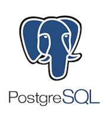

# Project 1: Relational Data Modeling with PostgreSQL

<p align="center"></p>

## Introduction
As a data engineer, I was responsible for developing a relational database to empower the analytics team at Sparkify, a recent startup. They were interested in analyzing data collected on songs and user activity through their new music streaming app. Currently, the data resides in a directory of JSON logs on user activity on the app, as well as a directory with JSON metadata on the songs in their app. The analytics team have no easy way to query their data.

### Achievements
Data modeling with PostgreSQL and building an ETL pipeline using Python. Define fact and dimension tables for a star schema for a particular analytic focus, and write an ETL pipeline that transfers data from files in two local directories into these tables in PostgreSQL using Python and SQL.
Skills include:
* Building out an ETL pipeline using Python
* Creating a database schema and ETL pipeline for this analysis
* Creating a PostgreSQL database with tables designed to optimize queries on song play analysis
* Testing the database and ETL pipeline by running queries given to you by the analytics team from Sparkify and comparing results with their expected results.

# Available Data
### Song Dataset
The first dataset is a subset of real data from the [Million Song Dataset](https://labrosa.ee.columbia.edu/millionsong). Each file is in JSON format and contains metadata about a song and the artist of that song. The files are partitioned by the first three letters of each song's track ID. For example, here are filepaths to two files in this dataset.

```
song_data/A/B/C/TRABCEI128F424C983.json
song_data/A/A/B/TRAABJL12903CDCF1A.json
```
And below is an example of what a single song file, TRAABJL12903CDCF1A.json, looks like.
```
{"num_songs": 1, "artist_id": "ARJIE2Y1187B994AB7", "artist_latitude": null, "artist_longitude": null, "artist_location": "", "artist_name": "Line Renaud", "song_id": "SOUPIRU12A6D4FA1E1", "title": "Der Kleine Dompfaff", "duration": 152.92036, "year": 0}
```
### Log Dataset
The second dataset consists of log files in JSON format generated by this event simulator based on the songs in the dataset above. These simulate app activity logs from a music streaming app based on specified configurations.

The log files in the dataset you'll be working with are partitioned by year and month. For example, here are filepaths to two files in this dataset.

```
log_data/2018/11/2018-11-12-events.json
log_data/2018/11/2018-11-13-events.json
```

# Schema for Song Play Analysis
Using the song and log datasets, you'll need to create a star schema optimized for queries on song play analysis. This includes the following tables.


#### Fact Table
1. songplays - records in log data associated with song plays i.e. records with page `NextSong`
    * songplay_id, start_time, user_id, level, song_id, artist_id, session_id, location, user_agent

#### Dimension Tables
2. <b>users</b> - users in the app
    * user_id, first_name, last_name, gender, level
3. <b>songs</b> - songs in music database
    * song_id, title, artist_id, year, duration
4. <b>artists</b> - artists in music database
    * artist_id, name, location, lattitude, longitude
5. <b>time</b> - timestamps of records in <b>songplays</b> broken down into specific units
    * start_time, hour, day, week, month, year, weekday
